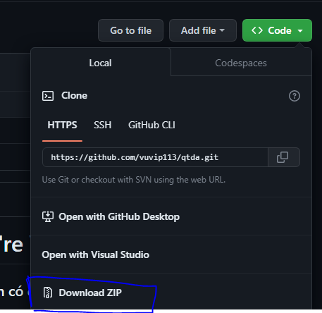
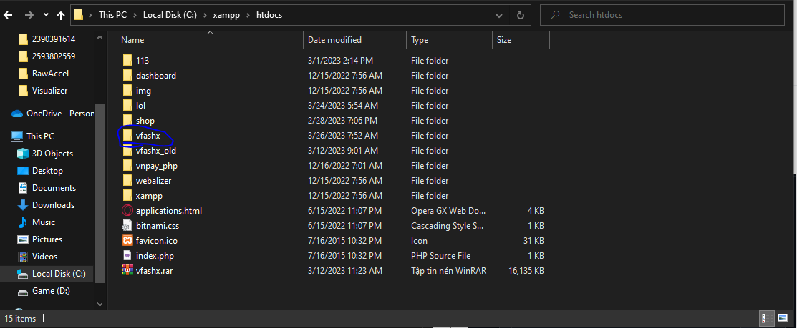
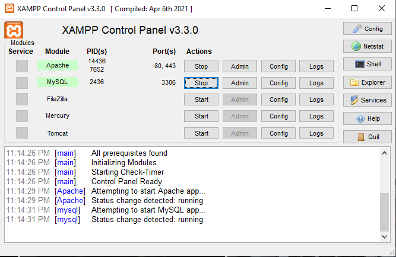
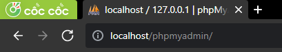
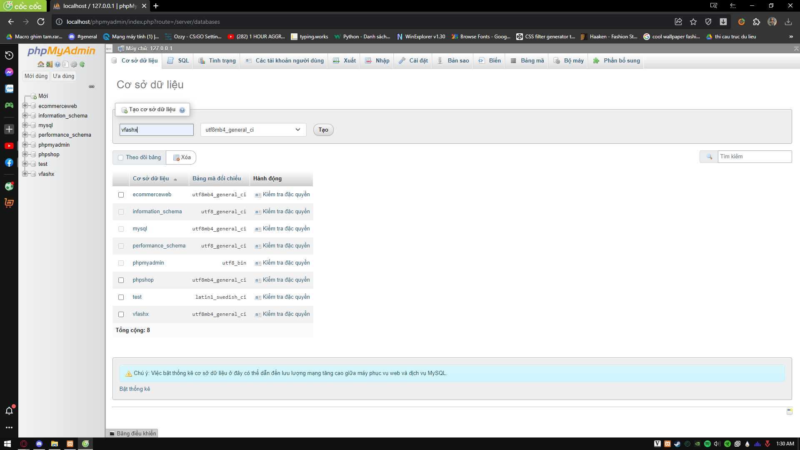

<h1 align="center">Hi 💓, We're Vfashx</h1>
<h3 align="center">Làm 1 web site đơn giản có đầy đủ chức năng</h3>

<p align="left">  </p>
<p align="left"> <a href="https://twitter.com/" target="blank"></a> </p>
- 🔭 We're currently working on [Github](https://github.com/vuvip113/qtda)

- 🌱 We're currently learning **PHP WEB**

- 💬 Ask me about **PHP CODE, ANIMATION**

- 📫 How to contact me **vucute775@gmail.com**


## Yêu cầu mồi trường

Để chạy dự án này, bạn cần thêm các biến môi trường sau của mình

Cài đặt và sử dụng `XXAMPP` [👉](https://choosealicense.com/licenses/mit/)

Biết sử dụng ngôn ngử để tạo web css, php, js,...


# Cách chạy chương trình

▶️ Dowload 2 file trên về r giải nén ra
 + vfashx (folder)
 + vfashx.sql



▶️ Copy file vfashx paste vào địa chỉ sau `C:\xampp\htdocs`


▶️ Mở Xampp click Start 2 cái 
+ Start `Apache`
+ Start `MySQL`



▶️ Mở Mạng web (Cốc Cốc, Chorme, ...)
- Sử dụng dụng câu lệnh 
```bash
  http://localhost/phpmyadmin/
```

- Tạo 1 database ten la `vfashx` 
![App Screenshot](https://lh3.googleusercontent.com/pw/AJFCJaU-2GZFL8CJ_B44UbX2ICs3dx_f-Xpuz5rM1JTzmMg_xPL6z_XeV5oZC85mnCND0qgouhdsBP8t8NrN6uhBwuyYSRXT-mNAPLo7dk5pfIjwCWQz7IU_f_OZZUdwxNbwEy-qpJf8WChQGpkiVCg04VPizm00NL8XmSG7_p5IO4XXUW3fRLAc5EwwvLq2z7JcZm06KCH4uyFVwRsG6HQl-C7_shqqBvcZdiWYYug--3ByZVLkmCcdRqHTU3_6T0r48nh-52f6txCzSZpTza7oO1vKJokKeJIDjDLDjCI5axNzZ0R9HuejISuRJ4ivG3u7-UVLZhudZfsevNeO-V9uUqd8eqhL6vTaY4xDpWb_lwJvgEDA0E3lFFoGMILobl3k6jMbnU5U3RLewwEvJl1MsWe2wnSSbY3eyB5cJ4gR3wzxPD_FS2pLMqTj4gHW2W1TqYrjRDvc1ertPzJGrd8cD0YWV8y5eUOBaEPyrNDAeifveGwPNJrnNfopC2VHeX8-yNTI0GPlffRAghZTtGnrCdmX8QRSUoLAt5mfr8WRGLYiXp2pxjN1RJXjnlUo5KWaGK-jYKGW2QPR3cMd-NpgDSBtpNpeld-itJ5BONvq7wIZ-k9twRmVJiTA55sw_A44BJDCay2FC0Ftzh5gHtrcNaz4H_02KduGont8_k3K7RNrMtIa8fMZG2mmprw9_C4g_6ONg92szJP9UvBBMuxSWSort2WNz3nLiEpvS9akX4O6vRzLLKS4yQnL9VRkMRRgnp_4gtGGWmyiTr_BEhfQi928oNuV7dKXcbgQx9lLmjczcdrRNLoVavCOoh9QN_QpJ2aEwfaqK4LQcxIG2pZ7p-SwqSr9hXv-h5pq4h6ANl9RCzNL9Ay27p0u62Q1AnZ6tyXdELXkoaYPUD_6cs2sz3VGK1pM9LCyFCCpVYMvyZzh-bIn3p97BIkQKzQuwJUW8hCGuUA08kVs9-IV5TfitfFCGmUmkbXTgu-tqW-hcNNCa7LNxCjm-d2NoGHgakAVrt8=w1175-h661-s-no?authuser=1)

- Vào database `vfashx` Chọn Nhập -> Chọn Tệp -> sử dụng tệp `vfashx.sql` mà đã tải về -> Open -> Nhập


-> Thành công sẽ hiện ra bảng nhập thành công nếu lỗi thì kiểm tra lại các bước trên 


▶️ Mở tab web mới (Cốc Cốc, Chorme, ...)
- Sử dụng dụng câu lệnh 
```bash
  http://localhost/vfashx/
```


<h1 align="center">Chúc Các Bạn Thành Công 👋👋👋</h1>
